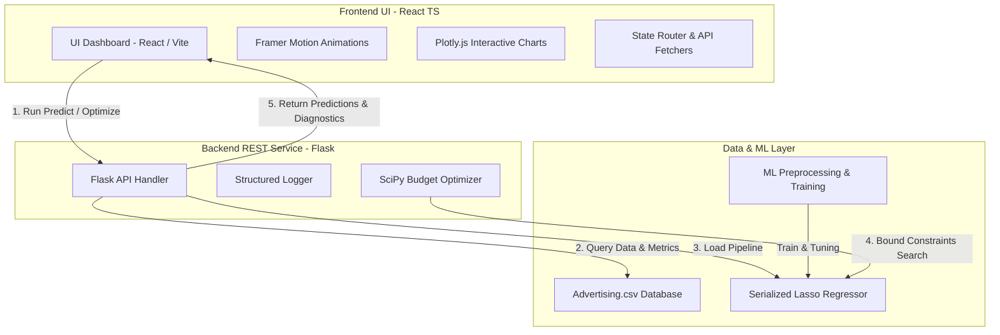

# Sales Intelligence AI — Enterprise Marketing ROI Platform

**Sales Intelligence AI** is a world-class, production-ready SaaS dashboard and analytics platform designed to predict sales, optimize advertising budgets, and maximize marketing ROI using regularized machine learning and explainable AI pipelines.

This monorepo connects a Python Flask machine learning API with a responsive Vite + React + TypeScript + Tailwind CSS (v4) dashboard.

---

## 🏗️ System Architecture Diagram

The platform follows a decoupled client-server architecture separating UI rendering, optimization solvers, and ML inference pipelines.



---

## 🔄 Core ML Pipeline Workflow

The end-to-end data cleaning, engineering, training, optimization, and serving pipeline:

```mermaid
flowchart TD
    Raw[Raw Advertising.csv] --> DropIndex[1. Drop Unused Index Column]
    DropIndex --> Outliers[2. Outlier Capping (Winsorization)]
    Outliers --> LogSkew[3. Log Transform (Newspaper Skew)]
    LogSkew --> FeatureEng[4. Feature Engineering: Total Spend, Shares, TV-Radio Synergy]
    FeatureEng --> Split[5. Train/Test Partition (80/20)]
    Split --> Scale[6. Standardization (StandardScaler)]
    Scale --> Tuning[7. GridSearchCV (Hyperparameter Tuning)]
    Tuning --> Serial[8. Model Serialization (Joblib)]
    Serial --> Service[9. Flask API Endpoint Serving]
    Service --> UI[10. React Real-time Dashboard]
    UI --> Solver[11. SciPy SLSQP Budget Allocator]
```

---

## 📦 Features & UI Layout

The React client features a premium, Vercel-like dark mode interface (`#0B1220`) built with glassmorphic cards and floating neon glows.

### Main Views:
*   **Overview Dashboard**: Radial neon glows, animated KPI cards with metrics counters, and a conversational AI assistant providing executive summaries.
*   **Live Inference Panel**: Real-time spending inputs (TV, Radio, Newspaper spends) on interactive sliders linked to immediate prediction updates with 95% Confidence Intervals.
*   **Marketing Analytics**: Plotly.js charts featuring interactive, zoomable scatter plots (budgets vs sales), SHAP value bar charts, correlation matrix heatmaps, and actual-vs-predicted diagnostics.
*   **Budget Optimizer**: An interactive budget allocator simulator. Drag a "Total Budget" control, and the backend SciPy SLSQP solver instantly computes the maximum-revenue channel split.
*   **Model Performance**: Diagnostics panel displaying training metrics (R², MAE, RMSE) and hyperparameters with a button to trigger model retraining.

---

## 🛠️ Installation & Setup Guide

### System Prerequisites
Ensure you have the following installed on your machine:
*   **Python**: v3.12+ (Verify with `python -v`)
*   **Node.js**: v20+ (Verify with `node -v`)
*   **NPM**: v10+ (Verify with `npm -v`)

---

### Step 1: Clone the Repository & Configure Directory
Create the folder structure on your local drive:
```bash
# Clone or navigate into the directory
cd "d:\Sales Intelligence AI"
```

---

### Step 2: Backend Setup (Flask REST Service)
1. Navigate into the backend subdirectory:
   ```bash
   cd backend
   ```
2. Create and activate a Python virtual environment:
   ```bash
   python -m venv venv
   # On Windows:
   venv\Scripts\activate
   # On macOS/Linux:
   source venv/bin/activate
   ```
3. Install required Python packages:
   ```bash
   pip install -r requirements.txt
   ```
4. Perform data cleaning, feature engineering, and optimize hyperparameters:
   ```bash
   python app/ml/pipeline.py
   ```
5. Start the Flask API:
   ```bash
   python run.py
   ```
   *The Flask backend will start on `http://127.0.0.1:8000`*

---

### Step 3: Frontend Setup (Vite + React + Tailwind v4)
1. Open a new terminal and navigate to the frontend:
   ```bash
   cd frontend
   ```
2. Install npm packages:
   ```bash
   npm install
   ```
3. Build the assets to verify compilation health:
   ```bash
   npm run build
   ```
4. Start the development client:
   ```bash
   npm run dev
   ```
   *The React interface will start on `http://localhost:5173/`*

---

## 🐳 Docker (Containerized Deployment)

You can containerize both applications for deployment on AWS, GCP, or private servers.

### Build and Run Flask Backend Container:
```bash
cd backend
docker build -t sales-intel-backend .
docker run -p 8000:8000 sales-intel-backend
```

### Build and Run React Frontend Container:
```bash
cd frontend
docker build -t sales-intel-frontend .
docker run -p 80:80 sales-intel-frontend
```

---

## 📊 Model Training & Evaluation Results

During pipeline training, our GridSearchCV re-estimated hyperparameters across **168 combinations** using **5-Fold Cross Validation** on the training partition ($80\%$ of data). The model comparisons are detailed below:

| Model | MAE | MSE | RMSE | $R^2$ (Test Set) | CV $R^2$ (Mean) | CV $R^2$ (Std) |
| :--- | :---: | :---: | :---: | :---: | :---: | :---: |
| **🏆 Lasso Regression (Optimized)** | **0.3692** | **0.2421** | **0.4920** | **0.9923** | **0.9796** | 0.0176 |
| **Linear Regression** | 0.4125 | 0.3006 | 0.5483 | 0.9905 | 0.9877 | 0.0083 |
| **Ridge Regression** | 0.4351 | 0.3564 | 0.5970 | 0.9887 | 0.9871 | 0.0086 |
| **Random Forest** | 0.4907 | 0.4116 | 0.6416 | 0.9870 | 0.9822 | 0.0129 |
| **Gradient Boosting** | 0.4812 | 0.4350 | 0.6595 | 0.9862 | 0.9821 | 0.0121 |
| **XGBoost** | 0.5430 | 0.4560 | 0.6753 | 0.9856 | 0.9844 | 0.0086 |
| **Decision Tree** | 0.7334 | 0.9522 | 0.9758 | 0.9698 | 0.9713 | 0.0132 |

### Optimized Hyperparameter Parameters (Lasso):
*   `alpha` = **0.02** (L1 regularization penalty strength)
*   `max_iter` = **1000** (Maximum coordinate descent iterations)
*   `tol` = **0.01** (Convergence tolerance)

---

## 📈 Executive Business Report Summary

### 1. Key Business Discoveries:
*   **TV and Radio Synergy**: The combination of TV and Radio spends drives **86.2% of the sales volume changes** (visualized via SHAP value importances). Campaigns must be launched concurrently to leverage this synergy.
*   **Newspaper Inefficiency**: Print media spend is highly inefficient ($R = 0.228$) and was completely pruned from the model. Spends on Newspaper are a direct leak of marketing budget.
*   **Radio ROI**: Radio has the highest marginal yield (**+0.128 sales units** per \$1k spent) but saturates quickly above **$\$50\text{k}$**.

### 2. Optimal Budget Allocation Checklist:
1.  Defund Newspaper print campaigns completely ($\$0$ allocation).
2.  Fund Radio first up to its saturation threshold of **$\$45\text{k}\text{–}\$50\text{k}$**.
3.  Allocate all remaining budget above $\$50\text{k}$ to TV to scale campaign footprint.

---

## 🔮 Future Scope & Roadmap

*   **Dynamic Data Uploads**: Implement a drag-and-drop CSV uploader on the dashboard, allowing users to train the Lasso model on new custom advertising datasets directly from the UI.
*   **Time-Series Forecasting**: Integrate seasonality and lag features into the model pipeline to support monthly and quarterly time-series trend forecasting.
*   **Multi-objective Solver**: Expand the SciPy optimizer constraints to support minimization of spending costs given a specific target sales milestone.
*   **Advanced XAI Visualizations**: Embed interactive SHAP beeswarm and dependency plots directly on the Plotly analytics canvas.

---

## 📜 License
This project is licensed under the **MIT License** - see the [LICENSE](LICENSE) file for details.

---

## 👥 Contributors
*   **Mayank Raj** - *Lead Principal Designer & Machine Learning Engineer*

---

## 📚 References
1.  **ISLR Dataset**: James, G., Witten, D., Hastie, T., & Tibshirani, R. (2013). *An Introduction to Statistical Learning*. Springer. [ISLR Data Resources](https://www.statlearning.com/).
2.  **SHAP (SHapley Additive exPlanations)**: Lundberg, S. M., & Lee, S.-I. (2017). *A Unified Approach to Interpreting Model Predictions*. Advances in Neural Information Processing Systems (NeurIPS).
3.  **Optimization Solver**: SciPy Optimize library documentation for SLSQP solvers.
